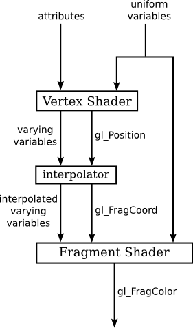

# A Guide to Shaders

## What is a Shader?

A shader is just a program that runs on your GPU instead of your CPU. Shaders allow us to customize the visual output of a graphics application.

There are many languages to write shaders in, but for this guide, we will be using the OpenGL Shader Language for Embedded Systems, version 1.0, or GLSL ES 1.0.

Before we get into programming, let us lay a bit of theory on the table.

There are many kinds of shaders, but for now, we'll focus on two. The **vertex** shader and the **fragment** shader.

### Vertex shader

The vertex shader is the first programmable stage in the graphics pipeline. This is because it processes each vertex of the geometry, and it does so individually. Its main responsibilities include:

-   Transforming vertex coordinates from model space to clip space. In clip space coordinate system, each axis has a range from -1.0 to 1.0, regardless of aspect ratio, actual size, or any other factors.
-   Passing per-vertex data like colour, texture coordinates, and normals to the next stage in the pipeline.

After performing all needed transformations, the vertex shader returns the transformed vertex by saving it in a special variable called `glPosition`. 

The vertex shader can do the following:
* determine the coordinates within the face's texture of the texel ( a texel is just a single pixel within a texture  to apply to the vertex.)
* apply normals to determine the lighting factor to apply to the vertex.  

The information is stored in the `varying` or `attribute` variables to be shared with the fragment shader.

### Fragment shader

The fragment shader operates on each fragment that will potentially form part of the final pixel colour in the rendered image. This basically means that it is called once for every pixel on each shape to be drawn. It is also called the pixel shader. It is responsible for:

-   Setting the colour of pixels based on various inputs, including data passed from the vertex shader
-   Performing complex computations to create effects like texturing, shading, and lighting.

The results of the computation are stored in the variable `gl_FragColor`.

Here is a picture to encapsulate this pipeline:



### Variables

While shaders change how our renders look, they don't have the ability to generate new renders. For this reason, we have to pass all the information about our renders to the shaders. We use variables to do this. There are two types, attribute variables and uniform variables.

#### Attribute variables

Attribute variables are used in the vertex shader. They are used to receive per-vertex data from the application on the CPU. This could include vertex coordinates, normals, colours, and texture coordinates. Each vertex processed by the vertex shader gets its set of attribute values.

Examples include:

```c
attribute vec4 a_position;
attribute vec3 a_color;
```

#### Uniform variables

Uniform variables provide a way to pass information to either the vertex or fragment shader. Uniform variables are kind of like constants in the sense that they keep the same value across the execution of all vertices or fragments in a single draw call. They are commonly used to pass transformation matrices, light information, or global settings to the shaders.

Examples include:

```C
uniform mat4 u_modelViewMatrix;
uniform mat4 u_projectionMatrix;
```

#### Varying variable

Varying variables allow us to pass interpolated data from the vertex shaders to the fragment shaders. This typically includes texture coordinates, per-vertex colours, and transformed normals. The rasterizer, for example, interpolates the values output by the vertex shader for each vertex of a primitive to generate the corresponding input for the fragment shader.

To use a varying variable, it should be declared in bother shaders, with the same name and type.

Examples include:

```C
varying vec3 v_color;
```

## Creating a shader

Now that we've gotten some theory out of the way, we can start getting into the fun part. Creating a shader involves declaring your shaders, compiling them, linking them to your program, and attaching them to the OpenGL context for rendering.

Because of how widely used OpenGL is, it is available on different languages. This means that while the process of loading shaders is the same, the syntax and procedures , may be different.

Below, i have included guides to using OpenGL with different languages:

* [Shaders in C](https://github.com/refiloemopeloa/Shaders/blob/main/C/Shaders%20in%20C.md)
* [Shaders in WebGL](https://github.com/refiloemopeloa/Shaders/blob/main/WebGL/Shaders%20in%20WebGL.md)

Let's go over the steps for creating a shader. There will be some variation per language but the fundamental ideas are the same.

### Declaring a shader

First you'll need to declare the variables that will hold your shader code. Then you need to decide if you are adding your code in-line, internally, or externally.

#### Internal shaders

Internal shaders is when you type your shaders directly in your program, similar to internal CSS. This reduces the complexity of loading your shaders, but also makes it harder to read. You also lose the support of any support from your IDE if you're using one, since it views it as a string, not actual code.

#### External shaders

External shaders is when you write your shaders in a different file to your program. Shader files don't really have extensions, so you can use whatever you'd like. However, as good practice, you can give your shader files the extension `.glsl`. If you'd like to be more specific, you can add the type of shader to the extension, like `.vertex.glsl`.

If you use this method, you'll need some way of reading the file into your program.

### Compile a shader

Compiling your shader involves passing your code to the GLSL compiler. It will return some integer value, which you can use to check if the compilation was successful or not. After you've compiled your shader, you can free the variable storing your code.

### Creating a shader program

This step involves creating a program that will combine the compiled shaders into a program object.

### Linking a shader

Once you've created the shader program, you attach the shaders to the program, then link the program.

### Using a shader

Finally, you call a function to use the shader program. 

# References

1. [Chapter 10 The Programmable Pipeline | Computer Graphics and Visualisation (wits.ac.za)](https://courses.ms.wits.ac.za/~branden/CGV/_book/pipe.html)
2. [glDrawArrays - OpenGL 4 Reference Pages (khronos.org)](https://registry.khronos.org/OpenGL-Refpages/gl4/html/glDrawArrays.xhtml)
3. [Adding 2D content to a WebGL context - Web APIs | MDN (mozilla.org)](https://developer.mozilla.org/en-US/docs/Web/API/WebGL_API/Tutorial/Adding_2D_content_to_a_WebGL_context)