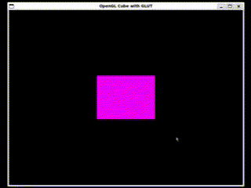

# A Guide to Shaders

## What is a Shader?

A shader is just a program that runs on your GPU instead of your CPU. Shaders allow us to customize the visual output of a graphics application.

There are many languages to write shaders in, but for this guide, we will be using the OpenGL Shader Language for Embedded Systems, version 1.0, or GLSL ES 1.0.

Before we get into programming, let us lay a bit of theory on the table.

There are many kinds of shaders, but for now, we'll focus on two. The **vertex** shader and the **fragment** shader.

### Vertex shader

The vertex shader is the first programmable stage in the graphics pipeline. This is because it processes each vertex of the geometry, and it does so individually. Its main responsibilities include:

-   Transforming vertex coordinates from model space to screen space.
-   Passing per-vertex data like colour, texture coordinates, and normals to the next stage in the pipeline.

### Fragment shader

The fragment shader operates on each fragment that will potentially form part of the final pixel colour in the rendered image. It is also called the pixel shader. It is responsible for:

-   Setting the colour of pixels based on various inputs, including data passed from the vertex shader
-   Performing complex computations to create effects like texturing, shading, and lighting.

Here is a picture to encapsulate this pipeline:


### Variables

While shaders change how our renders look, they don't have the ability to generate new renders. For this reason, we have to pass all the information about our renders to the shaders. We use variables to do this. There are two types, attribute variables and uniform variables.

#### Attribute variables

Attribute variables are used in the vertex shader. They are used to receive per-vertex data from the application on the CPU. This could include vertex coordinates, normals, colours, and texture coordinates. Each vertex processed by the vertex shader gets its set of attribute values.

Examples include:

```c
attribute vec4 a_position;
attribute vec3 a_color;
```

#### Uniform variables

Uniform variables provide a way to pass information to either the vertex or fragment shader. Uniform variables are kind of like constants in the sense that they keep the same value across the execution of all vertices or fragments in a single draw call. They are commonly used to pass transformation matrices, light information, or global settings to the shaders.

Examples include:

```C
uniform mat4 u_modelViewMatrix;
uniform mat4 u_projectionMatrix;
```

#### Varying variable

Varying variables allow us to pass interpolated data from the vertex shaders to the fragment shaders. This typically includes texture coordinates, per-vertex colours, and transformed normals. The rasterizer, for example, interpolates the values output by the vertex shader for each vertex of a primitive to generate the corresponding input for the fragment shader.

To use a varying variable, it should be declared in bother shaders, with the same name and type.

Examples include:

```C
varying vec3 v_color;
```

## Creating a shader

Now that we've gotten some theory out of the way, we can start getting into the fun part. Creating a shader involves declaring your shaders, compiling them, linking them to your program, and attaching them to the OpenGL context for rendering.

Because of how widely used OpenGL is, it is available on different languages. This means that while the process of loading shaders is the same, the syntax and procedures , may be different. For this guide, we'll focus on doing it with C. This method will work on C++ as well. For other languages, such as JavaScript using WebGL, refer to this guide: [[Shaders in WebGL]].

### Declaring a shader

Before we begin, ensure you've imported `GL/glut.h`.

First, we need a variable to point to the code of our shader:

```C
const char *vertex_shader_source;
const char *fragment_shader_source;
```

From here there are two methods you can follow:

#### Internal shaders

Internal shaders is when you type your shaders directly in your program, similar to internal CSS. This reduces the complexity of loading your shaders, but also makes it harder to read. You also lose the support of any support from your IDE if you're using one, since it views it as a string, not actual code.

Let's look at an example:

```C
const char *vertex_shader_source =
//Declare local variables
"    attribute vec4 a_position;\n"
"    attribute vec3 a_color;\n"
"    uniform mat4 u_modelViewMatrix;\n"
"    uniform mat4 u_projectionMatrix;\n"
"    varying vec3 v_color;\n"
//Define a main method
"void main() {\n"
"    v_color = a_color;\n"
"    gl_Position = u_projectionMatrix * u_modelViewMatrix * a_position;\n"
"}\0";
```

#### External shaders

External shaders is when you write your shaders in a different file to your program. Shader files don't really have extensions, so you can use whatever you'd like. However, as good practice, you can give your shader files the extension `.glsl`. If you'd like to be more specific, you can add the type of shader to the extension, like `.vertex.glsl`. Here's an example:

```C
//file: vertex_shader.glsl

//Declare local variables
    attribute vec4 a_position;
    attribute vec3 a_color;
    uniform mat4 u_modelViewMatrix;
    uniform mat4 u_projectionMatrix;
    varying vec3 v_color;
//Define a main method
void main() {
    v_color = a_color;
    gl_Position = u_projectionMatrix * u_modelViewMatrix * a_position;
}
```

To pass this to C, we need to read from the file. You can use this function to read from the file:

```C
char* read_shader_source(const char* file_path) {

    FILE* file = fopen(file_path, "r");

    if (file == NULL) {

        printf("Failed to open file: %s\n", file_path);

        return NULL;

    }


    // Seek to the end of file to determine its size

    fseek(file, 0, SEEK_END);

    long fileSize = ftell(file);

    fseek(file, 0, SEEK_SET);


    // Allocate memory for the file content

    char* content = (char*)malloc(fileSize + 1);

    if (content == NULL) {

        printf("Failed to allocate memory for file content\n");

        fclose(file);

        return NULL;

    }


    // Read the file content

    size_t bytesRead = fread(content, 1, fileSize, file);

    if (bytesRead < fileSize) {

        printf("Failed to read file content\n");

        free(content);

        fclose(file);

        return NULL;

    }


    content[fileSize] = '\0';  // Null-terminate the string

    fclose(file);

    return content;

}
```

Then set your vertex shader pointer to the following:

```C
char *vertex_shader_source = read_shader_source("vertex_shader.glsl");
```

### Compile a shader

To compile a shader, we can call the following function:

```C
GLuint compile_shader(GLenum type, const char *source)

{

    GLuint shader = glCreateShader(type);

    glShaderSource(shader, 1, &source, NULL);

    glCompileShader(shader);


    int success;

    char infoLog[512];

    glGetShaderiv(shader, GL_COMPILE_STATUS, &success);

    if (!success)

    {

        glGetShaderInfoLog(shader, 512, NULL, infoLog);

        printf("ERROR::SHADER::COMPILATION_FAILED\n%s\n", infoLog);

        return 0;

    }

    return shader;

}
```

Then, store the compiled shader in a variable:

```C
GLuint vertex_shader = compile_shader(GL_VERTEX_SHADER, vertex_shader_source);
```

Once you've compiled your shader, you can free the memory buffer holding the code to your shader:

```C
free(vertex_shader_source);
```

### Linking a shader

Once we've compiled, we can link the shader. First we need to create a shader program:

```C
GLuint shader_program = glCreateProgram();
```

Then, we attach our shaders to the program:

```C
glAttachShader(shader_program, vertex_shader);
```

Finally, we link the program to the shader:

```C
glLinkProgram(shader_program);
```

Lastly, we can free our shaders:

```C
glDeleteShader(vertex_shader);
```

It is good practice to check if there are linking errors with your shaders. You can do this as follows:

```C
int success;

char infoLog[512];

glGetProgramiv(shaderProgram, GL_LINK_STATUS, &success);

if (!success) {

    glGetProgramInfoLog(shaderProgram, 512, NULL, infoLog);

    printf("ERROR::SHADER::PROGRAM::LINKING_FAILED\n%s\n", infoLog);

    exit(1);

}
```

### Using our shaders

The last thing we need to do to actually see the effects of our shaders is to call them in our code. This is usually done in the `display` function:

```C
glUseProgram(shader_program);
```

### Cube demo

Now that we've done everything above, we can make an actual program. Create a directory called `shader-cube`, and create three files in it, one called `cube.c`, one called `vertex_shader.glsl` and one called `fragment_shader.glsl`.

Once that is done, you can add the following code to each of the files:

In `main.c`:

You can find the code here: <a href="https://github.com/refiloemopeloa/Shaders/blob/main/C/shader-cube/cube.c">main.c</a>

In `vertex.glsl`:

```C
#version 330 core
layout (location = 0) in vec3 aPos;

uniform mat4 model;

out vec3 FragPos;

void main() {
    gl_Position = model * vec4(aPos, 2.0);
    FragPos = aPos;
}
```

In `fragment.glsl`:

```C
#version 330 core
out vec4 FragColor;

void main() {
    vec3 color;
    color = vec3(1.0, 0.0, 1.0);
    FragColor = vec4(color, 1.0);
}
```

You should get something like this:



You now have your cube with shaders determining the vertex positions and the color of the cube.

# References

1. [Chapter 10 The Programmable Pipeline | Computer Graphics and Visualisation (wits.ac.za)](https://courses.ms.wits.ac.za/~branden/CGV/_book/pipe.html)
2. [glDrawArrays - OpenGL 4 Reference Pages (khronos.org)](https://registry.khronos.org/OpenGL-Refpages/gl4/html/glDrawArrays.xhtml)
